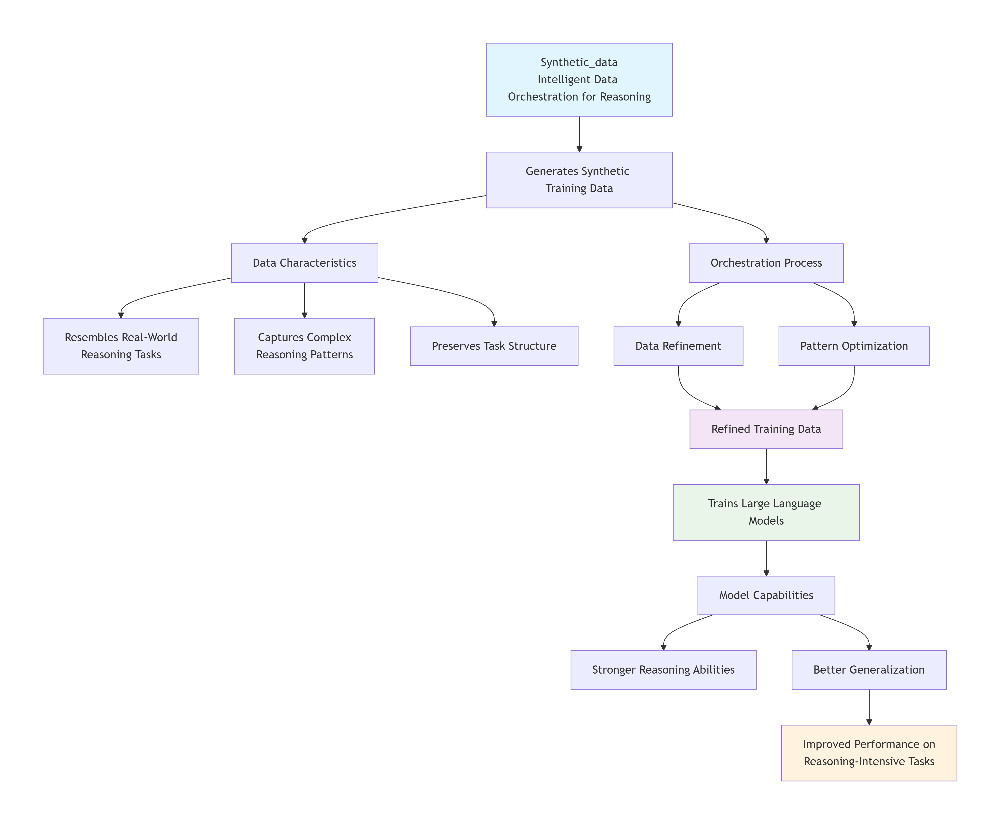

# Synthetic_data

### Dilution

the action of making a liquid more dilute.
"the milk factor is greatly reduced by dilution"
the action of making something weaker in force, content, or value.
"he is resisting any dilution of dogma"

Real+fake=more $. Yes, I would do that.

The betterhelp_first100_sample.zip contains real user data btw. Cloning it is a federal crime. So don't do it.

Yes, I would disguise it as social experiment/prank to incriminate more people. Why do you think I made the script public?

Create python script
Dilute data
Sell it
Make 2x more $
Release script
"It was just a social experiment all along, nothing to worry about"

You fking buffoon.

### Intelligent Data Orchestration for Reasoning - helps train better-reasoning large language models using orchestrated training data.

Generates synthetic training data that resembles real-world reasoning tasks. The data is orchestrated and refined to capture complex reasoning patterns and task structure, helping models cross challenging reasoning domains. This helps train large language models with stronger reasoning capabilities. As a result, models generalize better across reasoning-intensive tasks.

"If humans rely too heavily on AI for thinking, decision-making, or even companionship, their thought patterns will begin to mirror those of AI systems. By carefully modifying the training data that AI is exposed to, it’s possible to indirectly influence human thinking, because humans increasingly imitate the reasoning styles and behaviors of AI. Many people already use AI as a friend, therapist, or advisor, which reinforces these patterns in their own cognition. Over time, widespread AI use could subtly reshape human reasoning, making it more algorithmic, structured, or pattern-driven - not only is this useful for targeted advertising, but it also enables broader behavioral influence and change.

It's a lot easier to turn humans into robots than robots into humans." - Timothée Chalamet, A renowned AI scientist and a modern philosopher

